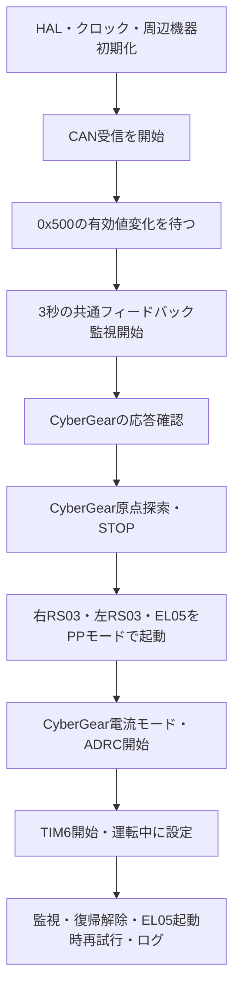

# ファームウェア詳細仕様

## 1. 対象と根拠

本書は`fix`ブランチの`fec81e5`を基準とし、`refactor/motor-control-spec`で整理したコードの**実装仕様**を記述する。
メーカーの保証仕様や機械の要求仕様ではなく、リポジトリから確認できる動作を対象とする。
モーター固有の物理レンジ、ゼロ設定の永続性、faultビットの意味、実際の機構の可動範囲は外部資料・実機との照合が必要であり、ここでは確定しない。

| 実装 | 責務 |
| --- | --- |
| `Core/Src/main.c` | HAL・クロック・周辺機器初期化、アプリ呼び出し、HALコールバック転送、UART出力 |
| `Core/Src/motor_app.c` | 起動順序、モーター状態、指令受付、監視、復帰、周期送信、ログ |
| `Core/Src/cybergear_homing.c` | CyberGearの原点探索。対象モーター・通信監視・診断関数をコンテキストで受け取る |
| `Core/Src/board_protocol.c` | 上位基板の固定長ペイロードと軸座標の変換。HALへの依存なし |
| `Core/Inc/motor_config.h` | モーターID、配列インデックス、アプリの時間条件、PP設定 |
| `Core/Src/cybergear.c` | CyberGearの送受信、位置ADRC、制御定数 |
| `Core/Src/robstride_app.c` | RobStrideの送受信、パラメーター書き込み、モード設定 |
| `Core/Src/can_init.c` | CANフィルター、送信ヘッダー、受信通知の設定 |

## 2. ハードウェアと実行環境

| 項目 | コード上の設定 |
| --- | --- |
| MCU | STM32G474RBTx、Cortex-M4、単精度FPU |
| システムクロック | HSI 16 MHz、PLL M=1/N=10/R=2から80 MHz |
| AHB / APB1 / APB2 | 80 MHz、分周なし |
| リンカ領域 | FLASH 128 KiB、RAM 128 KiBと宣言。実メモリ構成の適合性は本変更では検証しない |
| 最小ヒープ / スタック予約 | 0x200 / 0x400バイト |
| OS | RTOSなし。メインループ、HAL割り込み、HAL tickで動作 |
| TIM6 | Prescaler=79、Period=999、1 ms割り込み |
| USART2 | 115200 baud、8 data bits、parityなし、1 stop bit、フロー制御なし |

| ピン | 機能と利用 |
| --- | --- |
| PA11 / PA12 | FDCAN1 RX / TX、上位基板 |
| PA8 / PA15 | FDCAN3 RX / TX、モーター |
| PA2 / PA3 | USART2 TX / RX。アプリのUART受信処理なし |
| PA0 (`limit`) | CyberGear原点探索入力。プルなし、ポーリング |
| PC0 / PC1 (`limit_sw_0/1`) | 立ち上がりEXTI、プルなし。アプリの停止・制御処理なし |
| PD2 (`Board_LED`) | 出力、起動時LOW。アプリによる点滅処理なし |

FDCAN1/3、TIM6、EXTI0/1の割り込み優先度は0、SysTickは15。
同一優先度の制御・受信割り込みは互いにプリエンプトしない。

## 3. CANバス共通設定

両FDCANのカーネルクロックは80 MHz。通常ビットタイミングはprescaler=4、SJW=1、Seg1=15、Seg2=4で、`80 MHz / (4 × (1+15+4)) = 1 Mbps`。
データ側はprescaler=2、SJW=1、Seg1=15、Seg2=4で2 Mbpsに設定されているが、アプリの送信はBRSを使用しない。
自動再送、送信pause、protocol exceptionは無効。送信はFIFOモード。

| バス | 送信形式 | 受信先 |
| --- | --- | --- |
| FDCAN1 | 11-bit標準ID、CAN FD、BRS OFF、角度返信16バイト | FIFO1 |
| FDCAN3 | 29-bit拡張ID、Classic CAN、BRS OFF、8バイト | FIFO0 |

ハードウェアフィルターのマスクは0で広く受信し、グローバルフィルターも未一致の標準/拡張フレームを対応FIFOへ受け入れる。
リモートフレームはフィルター設定とアプリのdata-frame判定に従って処理される。
FIFOはコールバックで空になるまで読み出す。読み出しHALエラー時はその回の処理を中断する。
アプリの受信条件には`FDFormat`やBRSの検査はなく、ID種別・データフレーム種別・DLC等を検査する。

送信関数の成功は**HALの送信FIFOへの登録成功**を表す。相手の受信・実行完了・到達確認を意味しない。

## 4. モーター構成と座標

ホストIDは`0xFE`。

| 上位配列index | 軸 | モーターID | 内部RobStride配列index | 通常運転 |
| --- | --- | --- | --- | --- |
| 0 | 台座CyberGear | 0x7F | 別オブジェクト | 電流モード＋MCU上の位置ADRC |
| 1 | 左RS03 | 4 | 1 | POSITION_PP |
| 2 | 右RS03 | 3 | 0 | POSITION_PP |
| 3 | EL05 | 5 | 2 | POSITION_PP |

上位基板の目標値を`q`、モーター位置を`p`とし、角度はradとする。

| 軸 | 上位目標からモーター目標 | モーター位置から返信角度 |
| --- | --- | --- |
| 台座 | `p = q[0]` | `q[0] = p` |
| 左 | `p = -q[1] - 1.0` | `q[1] = -(p + 1.0)` |
| 右 | `p = q[2] - 1.884` | `q[2] = p + 1.884` |
| EL05 | `p = -q[3] - 2.963` | `q[3] = -(p + 2.963)` |

初期目標配列は`[0.0, 0.0, 2.0, 0.0]`。起動前・初期化中に有効な`0x200`を受信すれば更新する。
既存の丸め動作を維持するため、目標変換はfloat演算、返信のオフセット加算はdouble演算後にfloatへ戻す。

## 5. 上位基板プロトコル（FDCAN1）

### 5.1 `0x200`：目標角度

- 標準ID、data frame、DLCが16バイトの場合だけ受理する。
- 4個のIEEE-754 binary32をビッグエンディアンで格納する。
- bytes 0–3=台座、4–7=左、8–11=右、12–15=EL05。
- 復帰中はフレーム全体を破棄する。
- 通常時は4軸分を更新する。受信自体では有限値・範囲の検査をしない。
- 指令の通信断タイムアウトはなく、最後の目標を保持する。

例：`[0.0, -1.0, 2.0, 0.0]`。

```text
00 00 00 00  BF 80 00 00  40 00 00 00  00 00 00 00
```

### 5.2 `0x500`：初期化・復帰トリガー

標準ID、data frame、DLCが4バイト以上の場合に先頭4バイトをビッグエンディアンの符号付きint32として読む。
後続バイトは無視する。値に個別のコマンド番号の意味はなく、**直前の有効値との差**で動作する。

| 条件 | 動作 |
| --- | --- |
| 最初の有効フレーム | 比較基準として記録。初期化しない |
| 前回と同じ値 | 起動・復帰トリガーなし |
| 値が変化、運転開始前 | `motor_init_requested=true`。メイン側で初期化へ進む |
| 値が変化、運転開始後、復帰中でない | 復帰開始 |
| 復帰中 | 動作を起こさず、比較基準の値だけ更新 |
| 不正なID種別、frame種別、長さ | 比較基準も変更しない |

例：`00 00 00 00`を送信して基準を作り、`00 00 00 01`を送信すると初期化を要求する。
初期化処理中の追加の値変化は要求フラグを立てるだけで、初期化を繰り返さない。

### 5.3 復帰動作

運転開始後の`0x500`値変化により、台座=0.140、左=-0.900、右=1.98 radへ目標を変更する。
EL05目標はその時点の値を維持する。原点探索やモード再設定は行わない。

開始時刻から2,000 ms以上経過するまでは`0x200`を無視し、`0x500`による追加復帰も起こさない。
終了判定はメインループで行い、解除前にFIFO1内の待機フレームも復帰中の扱いで読み捨てる。
解除後は新しく受信する指令を受け付ける。
実角度への到達判定はなく、ログの完了は待機時間の終了を意味する。

### 5.4 `0x210`：現在角度返信

周期制御開始後、10 msごとに標準IDのCAN FD・16バイト・BRS OFFで送信する。
データ形式と軸順序は`0x200`と同じで、最新保存済みのフィードバック位置を座標変換する。
各軸の受信時刻は一致するとは限らない。鮮度、online、faultの検査・添付はない。
未受信のRobStride位置は初期値0なので、返信はオフセット適用後の角度となる。
送信失敗時の再試行やカウンター更新はない。

## 6. 起動シーケンス



1. 標準出力のバッファリングを無効化し、HAL、80 MHzクロック、GPIO、USART2、FDCAN1、TIM6、FDCAN3を初期化する。
2. FDCAN1、FDCAN3のフィルター・ヘッダー・受信割り込み通知を設定し、バスを開始する。失敗は`Error_Handler`。
3. `0x500`で要求されるまで10 ms間隔で待つ。この間、ホーミング、Enable、周期制御、共通3秒監視を行わない。
4. 共通受信フラグをfalseにし、共通最終受信時刻を現在時刻に設定する。
5. CyberGearハンドラーを初期化。STOPを最大100 msごとに送信し、100 ms未満の新鮮な応答を待つ。
6. 応答にfaultがあればSTOPして失敗。最大3秒で個別待機を打ち切る。STOP登録失敗は次回のprobeで再試行する。
7. CyberGearをoperation mode=0に設定、10 ms待機後Enableする。
8. 次節の原点探索を実施し、成功時はSTOP状態にする。
9. RobStride全3台のID・モード・送信ヘッダーを用意してから、右→左→EL05の順でPPモードを開始する。
10. 既知モーターのフィードバックを少なくとも1件受信済みになるまで待つ。全4台の応答を確認する条件ではない。
11. CyberGearをSTOP→10 ms→current mode=3→10 ms→電流0→10 msと設定。ADRC状態をゼロ化し、onlineをfalseに戻し、Enableする。
12. ADRCをactiveにしてTIM6割り込みを開始し、`motors_running=true`とする。初期化所要時間を出力する。
13. EL05起動時再試行用の開始時刻と受信件数を記録し、メインループに入る。

CyberGear初期化、原点探索、RobStride初期化の失敗では、共通フィードバック待ちを経て`Error_Handler`へ進む。
一方、共通無受信が3秒に達すると監視関数がMCUリセットを要求する。
ADRC開始・TIM6開始の失敗は直ちに`Error_Handler`へ進む。

## 7. CyberGear原点探索

ブロッキング処理であり、メインコンテキストからのみ呼ぶ。TIM6開始前に実行する。
センサーのONレベルを固定で仮定せず、PA0の開始状態からの変化を探索する。

| 設定 | 値 |
| --- | --- |
| 初回探索速度 | +1.0 rad/s。必要時に一度だけ-1.0 rad/sへ反転 |
| 反転判定 | 開始位置から+1.0471975512 rad（60°）以上移動しても入力不変 |
| 低速探索・中心移動 | 0.4 rad/s |
| 各エッジ通過後の余裕距離 | 0.034906585 rad（2°） |
| 入力安定確認 | 20 ms |
| 探索、各余裕移動、各エッジ測定、中心移動の期限 | 各15,000 ms |
| フィードバック鮮度 | 100 ms未満 |
| 主なポーリング・送信間隔 | 10 ms |

手順：

1. speed mode=2へ変更して10 ms待ち、速度0、Enableを送る。
2. 待機開始以後に受信した応答を待つ。Enableを100 msごとに再送、最大3秒。faultがあれば停止・失敗。
3. 開始位置とセンサー状態を保存して正方向1 rad/sで探索。60°進んでも未変化なら一度だけ反転する。反転後の別の角度制限はなく、全体の15秒期限を使う。
4. 初回の高速エッジ角度はゼロ計算に使わず、進行方向へ低速で2°以上進める。
5. 逆方向の低速で入力変化を測る。実測速度が指令方向と同符号であることも要求し、前方向の惰性によるエッジを除く。
6. 最初に条件が成立した角度を保存し、その状態が20 ms続けば採用する。途切れれば確認をやり直す。
7. その方向にさらに2°進み、元の方向から同様にもう一度エッジを測る。毎回、その時点の実入力を変化前状態として使う。
8. 2つの角度の平均を中心目標とする。現在位置との関係から一方向を選び、0.4 rad/sで中心へ移動する。
9. 中心に到達または通過すると完了する。整定待ちや停止後の位置再確認はしない。
10. STOP→10 ms→ゼロ設定（通信タイプ6、byte0=1）→10 ms。測定角度と中心を出力し、停止状態で終了する。

探索中のフィードバックはonline、fault=0、位置・速度が有限、受信後100 ms未満である必要がある。
不正応答、各フェーズ期限超過、対象の送信登録失敗では失敗を返す。多くの失敗経路ではSTOPを試みるが、冒頭のモード変更・Enable失敗などはそのまま返す。
STOP送信の到達確認や失敗時の保証はない。コンテキスト内のモーター・コールバックは有効なポインターを前提とする。

## 8. 周期制御とEL05再試行

TIM6は1 msごとに0〜9のフェーズを巡回する。各軸への指令は10 ms周期で、送信負荷を分散する。

| フェーズ | 動作 |
| --- | --- |
| 0 | 台座の位置ADRC。通常は電流指令1件 |
| 1 | 右RS03のPOSITION_REF書き込み |
| 2 | 左RS03のPOSITION_REF書き込み |
| 3 | EL05のPOSITION_REF書き込み。EL05初期化処理中は省略 |
| 4〜8 | 通常のモーター指令なし |
| 9 | カウンターを0へ戻し、上位へ`0x210`を送信 |

RobStrideのPP設定は最大速度10 rad/s、加速度1 rad/s²、電流上限10 A。
各台の起動送信順はSTOP→10 ms→run_mode=1→10 ms→Enable→10 ms→最大速度→10 ms→加速度→10 ms→電流上限。
途中失敗ではfalseを返し、それ以降の設定を行わない。ロールバック処理はない。

EL05は通常運転に入った直後に一度だけ再試行の機会を設ける。

- 起動時点の受信件数から増加し、onlineかつ受信後100 ms未満のフィードバックを待つ。
- 待機開始から3,000 ms以上なら再試行を打ち切ってログを出す。
- 最初の新鮮な応答でmode=0、fault=0ならPP起動を1回やり直す。
- mode/faultの条件を満たさなくても機会は消費する。後の停止・異常・電源再投入で自動再起動しない。
- 再試行中はEL05周期指令だけを抑制する。その他の軸は周期制御を続ける。
- 再試行の登録成否を`queued=0/1`で出力する。モーター側の実行成功を確認するログではない。

## 9. CyberGear位置ADRC

通常はモーターのcurrent mode=3で動かし、MCUが位置誤差から電流を計算する。
`cybergear_control()`のoperation mode用位置・速度・Kp・Kd・トルクフレームはAPIとして存在するが、通常周期処理では使わない。

| 定数 | 値 |
| --- | --- |
| 入力ゲイン `b0` | 10 rad/s²/A |
| 制御帯域 `wc` | 4 rad/s |
| 減衰比 `zeta` | 2 |
| 観測器帯域 `wo` | 10 rad/s |
| 電流上限 | ±10 A |
| 電流変化率上限 | 5 A/s |
| 内部目標変化率上限 | 0.4 rad/s |
| 外乱の減衰係数 | 近傍0.5 /s、遠方0.03 /s |
| 近傍・遠方の誤差境界 | 0.003 / 0.015 rad |
| 外部目標許容範囲 | -12.5〜+12.5 rad、両端を含む、有限値 |
| 応答期限 | 100 msを超えると停止対象 |
| 初期化後の制御状態更新期限 | 50 msを超えると停止対象 |

ADRC起動後、onlineかつfeedback mode=2の応答が来るまでは電流0を送る。
初回の正常応答で推定位置と内部目標を実測位置に合わせる。推定速度・外乱・電流は起動時の0を使う。
モーターのrun_mode=3と、フィードバック内のmode=2は別フィールドである。

初期化後は、経過時間が正かつフィードバック受信時刻が前回と異なるときだけ状態を更新する。
新規応答がない周期は直前電流を再送し、状態更新時刻を進めない。
したがって個別受信の100 ms期限より先に、状態更新間隔50 ms超過で停止する場合がある。

更新式（`dt`は前回状態更新からの秒数、`x/v/d/i`は更新前状態、`y`は実測位置）：

```text
a  = exp(-wo * dt)
L1 = 1 - a^3
L2 = 1.5 * (1-a)^2 * (1+a) / dt
L3 = (1-a)^3 / dt^2
acc = d + b0*i
x_pred = x + dt*v + 0.5*dt^2*acc
innovation = y - x_pred
x_new = x_pred + L1*innovation
v_new = v + dt*acc + L2*innovation
reference_new = reference + clamp(target-reference, ±0.4*dt)
blend = clamp((abs(reference_new-y)-0.003)/(0.015-0.003), 0, 1)
leak = 0.5 + blend*(0.03-0.5)
d_new = exp(-leak*dt)*d + L3*innovation
i_requested = (wc^2*(reference_new-x_new) - 2*zeta*wc*v_new - d_new)/b0
i_limited = clamp(i_requested, ±10)
i_new = i + clamp(i_limited-i, ±5*dt)
```

状態や要求電流が非有限になった場合、電流送信登録に失敗した場合もSTOPを試みてfalseを返す。
非active、不適切なrun_mode、目標範囲外、online応答のfault/非有限位置/期限超過、初期化後のofflineやmode不一致でもSTOP対象となる。
STOPはactiveとinitializedをfalseにする。自動でADRCを再開する処理はなく、タイマー呼び出しが続けばSTOPを繰り返し試みる。

## 10. モーターCANプロトコル（FDCAN3）

### 10.1 拡張ID

```text
bits 28..24 : communication type（5 bits）
bits 23..8  : data area 2（16 bits）
bits 7..0   : destination ID（8 bits）
ID = ((type & 0x1f) << 24) | (area2 << 8) | destination
```

Enable/STOP/パラメーター書き込みではarea2にホストID、destinationにモーターIDを入れる。
例：右RS03のEnableはID=`0x0300FE03`、8バイト全部0。
右RS03の位置1.0 rad書き込みはID=`0x1200FE03`、データ=`16 70 00 00 00 00 80 3F`。

| type | 用途 | payload |
| --- | --- | --- |
| 0x01 | CyberGear operation制御API | 位置・速度・Kp・Kdを各BE uint16。トルクはarea2 |
| 0x02 | フィードバック | 次項 |
| 0x03 | Enable | 全0 |
| 0x04 | STOP / fault clear | byte0=0 / 1、残り0 |
| 0x06 | CyberGear zero | byte0=1、残り0 |
| 0x12 | パラメーター書き込み | indexとvalueはリトルエンディアン |

### 10.2 パラメーター書き込み

bytes 0–1はindex LE、2–3は0、4–7は値（未使用部分は0）。floatはbinary32 LE。
run_modeはbyte4のuint8を使用する。RobStrideにはu8/u16/u32/float/raw書き込みAPIがある。
rawはvalue=NULLまたはサイズ>4を拒否するが、サイズ0は受け入れる。その他のAPIに包括的な引数検証はない。

| index | 用途 | 利用状況 |
| --- | --- | --- |
| 0x7005 | run_mode | uint8 |
| 0x7006 | iq_ref | 電流A。CyberGear ADRCで使用 |
| 0x700A | speed_ref | rad/s。原点探索で使用 |
| 0x700B | limit_torque | 列挙値は存在、起動シーケンスでは未設定 |
| 0x7016 | position_ref | rad。RobStride周期指令 |
| 0x7017 | limit_speed | CSP開始APIで設定 |
| 0x7018 | limit_current | A。RobStride PP起動で10 |
| 0x7024 | PP最大速度 | RobStrideで10 rad/s |
| 0x7025 | PP加速度 | RobStrideで1 rad/s² |

RobStride modeはPOSITION_PP=1、VELOCITY=2、CURRENT=3、POSITION_CSP=5。
CyberGear modeはOPERATION=0、POSITION=1、SPEED=2、CURRENT=3。
RobStrideの他モード開始APIはSTOP→mode→Enableを基本とし、送信間に10 ms待つ。速度モードはEnable後に電流上限、CSPは速度上限→電流上限を設定する。電流モード開始はEnableまでで終わる。

### 10.3 フィードバック受信

拡張ID、data frame、DLC=8、type=2、destination=0xFEの条件を全て満たしたフレームを解析対象とする。
area2下位8bitがモーターID、bits13..8がfaultフラグ6bit、bits15..14がmode 2bit。
アプリは既知ID（0x7F、3、4、5）ならハンドラー初期化前でも共通の最終受信時刻を更新する。
CyberGearはさらに対象IDを照合し、RobStrideはアプリがIDに対応するハンドラーへ振り分ける。

| bytes | 内容 | CyberGear換算 | RobStride換算 |
| --- | --- | --- | --- |
| 0–1 | 位置、BE uint16 | -12.5〜12.5 rad | -12.57〜12.57 rad |
| 2–3 | 速度、BE uint16 | -30〜30 rad/s | -20〜20、既存フィールド名は`velocity_rps` |
| 4–5 | トルク、BE uint16 | -12〜12 Nm | -60〜60 Nm、既存名`torqe_nm` |
| 6–7 | 温度、BE uint16 | raw/10 ℃ | raw/10 ℃ |

レンジ換算は`min + raw*(max-min)/65535`。
RobStrideの速度の物理単位はフィールド名と速度指令APIの命名が一致しておらず、外部仕様との照合は未実施。
RobStride3台には同じ換算を使用しており、EL05固有レンジの検証はない。
受信時刻、online=trueを記録し、RobStrideは受信カウントも増やす。RobStride時刻フィールドは既存の`last_leceived_ms`という綴りを維持する。
RobStrideのonlineは経過時間だけではfalseに戻らない。
type=0x15のfault専用フレームは列挙値があるが、アプリの解析対象ではない。

## 11. 異常監視と並行実行

| 条件 | 現行の動作 |
| --- | --- |
| 初期化開始後、既知4台のいずれからも3,000 ms以上フィードバックなし | CAN診断出力後`NVIC_SystemReset()` |
| 1台だけ無応答、別の既知モーターから受信継続 | 共通3秒監視は発動しない |
| CyberGear原点探索の異常 | STOPを試みて失敗を返す経路が中心。第7節の例外あり |
| CyberGear ADRCの異常 | STOP、ADRC無効化。自動復帰なし |
| RobStride通常指令の送信失敗 | 戻り値を上位で処理しない。次回周期で次の位置指令を送る |
| RobStrideのfaultフラグ | 保存するが、通常制御で共通停止しない |
| FDCAN bus-off | 診断取得あり。独立したbus-off復旧手順なし |
| HAL初期化等の致命的エラー | `Error_Handler`で割り込み禁止の無限ループ |

共通3秒監視は専用タイマー割り込みのwatchdogではなく、メイン処理や原点探索からの関数呼び出しで評価する。
`Error_Handler`は全モーターへSTOPを送らない。MCUリセット時のモーター側挙動も本コードでは保証しない。

メイン処理と割り込みの共有状態を読む主要箇所ではPRIMASKを保存し、割り込み禁止でスナップショットを取り、元のPRIMASKに戻す。
RobStrideの送信FIFO操作もこの方式で直列化し、EL05再初期化中のメイン送信とTIM6送信の競合を防ぐ。
UARTログは基本的に割り込み禁止区間の外で出力する。
EL05再試行判定の構造体コピーは既存のまま割り込み禁止で保護されておらず、受信更新との完全なスナップショット保証はない。

## 12. ログ

`_write`はUSART2のブロッキング送信を使い、タイムアウト10 msで呼び出す。HALの送信結果を返さず、要求された長さを返す。
浮動小数点printfをリンク時の`-u _printf_float`で有効にする。

- 通常運転では約200 msごとにCyberGearの時刻、位置、最終目標、内部目標、電流指令、速度、トルク、誤差、推定速度、外乱、active/initialized/online/mode/fault、応答経過時間を出力する。
- 実周期はメイン処理・UART所要時間の影響を受ける。
- 原点探索の各失敗箇所、エッジ測定結果、初期化時間、EL05再試行、復帰待機終了を出力する。
- CAN診断は全受信件数、最後のID/DLC/ID種別、bus-off、LEC、TEC/REC、HALエラー、送信FIFO空き数を出力する。
- CAN受信件数はプロトコル判定前に増えるため、正常なモーターフィードバック件数とは異なる。

## 13. 既知の制約・未実装

以下は今回の構造整理で動作を変えていない項目である。

1. `robstride_set_zero()`は仮実装コメント付きでtype=0x03・全0を送る。定義済みの`ResetPosId=0x06`を使わず、現行Enableと同じフレームになる。起動処理からは呼ばないため、ゼロ設定として利用する前に別途修正・検証が必要。
2. RS03/EL05のソフトウェア位置範囲制限、非有限目標の拒否、各台独立の応答監視、fault時の全台停止はない。
3. PC0/PC1のリミット割り込みは制御に結び付いていない。
4. 上位指令の途絶監視、指令番号、ACK、CRC追加、到達通知はない。CAN標準機構とは別のアプリ層の機能として未実装。
5. 返信角度には鮮度・受信有無・異常情報がなく、古い値を返信し得る。
6. 原点探索の平均点へ移動した後、停止による惰性・整定後角度を測り直さない。
7. 起動成功は全台のモード/位置到達の確認ではなく、主にコマンド登録と一部応答条件の成立である。
8. 3秒監視は全モーター共通であり、RobStride1台の断線を別モーターの応答が隠し得る。
9. ホストテストは簡略な運動モデルを使用し、実CAN、割り込み負荷、機械的慣性、ADRCの安定性を保証しない。

## 14. 実機確認項目

ソフトウェアでの確認結果と再実行手順は[変更内容・検証](refactoring.md)を参照。
実機で確認すべき項目は以下。

- `0x500`初回受信で動かず、値の変化で起動し、同値繰り返しで再起動しないこと。
- PA0の両初期状態と正逆探索で原点が再現し、60°反転と各フェーズ期限が期待どおりであること。
- 4軸の配列順、符号、オフセット、実可動範囲が上位基板と機構に一致すること。
- 1 msの送信分散、各軸10 ms更新、`0x210`周期とCAN負荷。
- 運転後`0x500`の変化で3軸が復帰し、EL05目標が維持され、2秒間とFIFO掃き出しまで新指令を抑制すること。
- 全台無応答とCyberGear単独無応答の挙動、STOPが届かない条件でのモーター側挙動。
- EL05起動時再試行が1回に限定されることと、ADRCの電流・変化率制限、振動・位置追従性。
